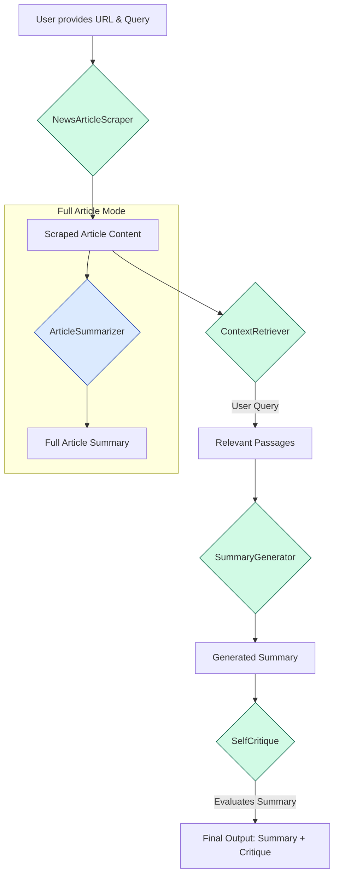

# News Article Summarizer

RAG-powered news article summarizer and Q&A — FastAPI backend, Next.js frontend, SQLite session persistence.

## Quick Start

```bash
cp .env.example .env
# Edit .env and add your API keys
docker compose up --build
```

- Frontend: http://localhost:3000
- Backend API: http://localhost:8000
- Health check: http://localhost:8000/health

## Requirements

| Key | Purpose |
|-----|---------|
| `ANTHROPIC_API_KEY` | Summarization and self-critique (Claude) |
| `VOYAGE_API_KEY` | Embedding-based passage retrieval |

## Architecture

```
frontend/   Next.js UI (React, Tailwind, TypeScript)
backend/    FastAPI API + SQLite session persistence
ai/         Shared AI logic: scraper, retriever, summarizer, critique
```

### API Routes

| Method | Path | Description |
|--------|------|-------------|
| GET | `/health` | Health check |
| POST | `/sessions` | Create session |
| GET | `/sessions/{id}` | Load session |
| POST | `/sessions/{id}/article` | Scrape article URL |
| POST | `/sessions/{id}/summarize` | Generate full summary |
| POST | `/sessions/{id}/chat` | Ask a question |
| GET | `/sessions/{id}/history` | Chat history |

### Session Persistence

Sessions are stored in SQLite at `/data/sessions.db` inside the backend container, backed by a Docker named volume (`session_data`). Sessions survive:
- Frontend refresh (session ID stored in `localStorage`)
- Backend exceptions (user message and error assistant reply are saved before raising)
- Container restart (volume persists across `docker compose down` / `up`)

## Hot Reload

Both services reload on code changes automatically:
- **Backend**: `uvicorn --reload` watches `backend/` and `ai/`
- **Frontend**: `next dev` with `WATCHPACK_POLLING=true` for Docker inotify compatibility

## Old Streamlit App (legacy)

The original Streamlit app still works:

```bash
pip install uv && uv sync
uv run python -m nltk.downloader punkt punkt_tab
uv run streamlit run app.py
```

## Known Limitations

- No authentication — all sessions are public by session ID
- SQLite is single-writer; fine for development, not production-scale
- Passage retrieval requires a Voyage API call per question (no local embeddings)

---

## Original Architecture

---

## 🏗️ Architecture Diagram

The application follows a sequential data flow, where the output of one component becomes the input for the next.



---

## ⚙️ Setup

### Step 1: Clone the Repository

```bash
git clone git@github.com:raadongithub/rag-news-summarizer.git
cd rag-news-summarizer
```

### Step 2: Add Your API Keys

Copy the example env file and fill in your keys:

```bash
cp .env.example .env
```

```env
ANTHROPIC_API_KEY="your-anthropic-api-key"
VOYAGE_API_KEY="your-voyage-api-key"
```

- `ANTHROPIC_API_KEY` — required for summarization and critique generation.
- `VOYAGE_API_KEY` — required for the retrieval/chat flow (Anthropic does not provide its own embedding model).

---

### 🐳 Option 1: Docker Compose (Recommended)

```bash
docker compose up --build
```

Open [http://localhost:8501](http://localhost:8501).

---

### 💻 Option 2: Streamlit App (Local)

Install dependencies and download NLTK data (one-time):

```bash
uv sync
uv run python -m nltk.downloader punkt
```

Run the app:

```bash
uv run streamlit run app.py
```

Open [http://localhost:8501](http://localhost:8501).

---

### 🖥️ Option 3: CLI

Install dependencies and download NLTK data (one-time):

```bash
uv sync
uv run python -m nltk.downloader punkt
```

Run the CLI:

```bash
uv run python pipeline.py
```

**Usage:**
- Enter a news article URL when prompted
- Ask questions about the article
- Type `new` to switch to a different URL
- Type `exit` to quit

**Example:**
```
Please enter the news article URL (or type 'exit' to quit): https://example.com/news-article
URL set to: https://example.com/news-article

Ask a question about the article (type 'new' for a new URL, 'exit' to quit): What is the main topic?
[Pipeline executes and shows results]

Ask a question about the article (type 'new' for a new URL, 'exit' to quit): new
Overwriting URL...

Please enter the news article URL (or type 'exit' to quit): exit
Exiting the program. Goodbye!
```