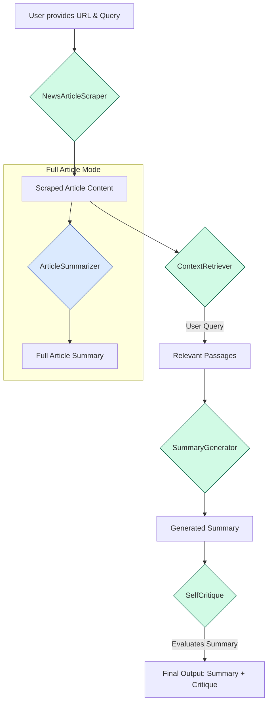

# 📰 News Article Summarizer & Query Engine

## 📖 Project Overview

This project is a sophisticated tool designed to scrape news articles from URL, generate comprehensive summaries, and answer specific user questions about the article's content in a concise manner. It leverages a pipeline of:

* Web scraping
* Context retrieval
* AI-powered summarization with self-critique

The application runs as an interactive **Streamlit** web app and supports both **Docker-based deployment** and **local setup**.

---

## 🏗️ Architecture Diagram

The application follows a sequential data flow, where the output of one component becomes the input for the next.



---

## ⚙️ Setup Instructions

This guide walks you through running the app either using Docker or locally.

### 🔑 Step 1: Add Your OpenAI API Key

1. In the root of the project, create a file named `.env`
2. Add your API key in the following format:

   ```env
   OPENAI_API_KEY="your-secret-api-key"
   ```

---

### 🐳 Option 1: Run with Docker (Recommended)

1. **Download the app image**
   Open a terminal and run:

   ```bash
   docker pull raadondock/news_summarizer
   ```

2. **Run the container**

   ```bash
   docker run -p 8501:8501 -v "$(pwd)/.env:/app/.env" raadondock/news_summarizer
   ```

3. **Open the app**
   Go to [http://localhost:8501](http://localhost:8501) in your browser.

---

### 💻 Option 2: Run Locally Without Docker

1. **Install dependencies**
   Ensure you have Python installed. Then run:

   ```bash
   pip install uv
   uv pip install -r pyproject.toml
   ```

2. **Download NLTK data (one-time setup)**

   ```bash
   python -m nltk.downloader punkt
   ```

3. **Run the Streamlit app**

   ```bash
   streamlit run app.py
   ```

4. **Access the app**
   Your browser should open automatically. If not, go to the URL displayed in the terminal (typically [http://localhost:8501](http://localhost:8501)).

---
