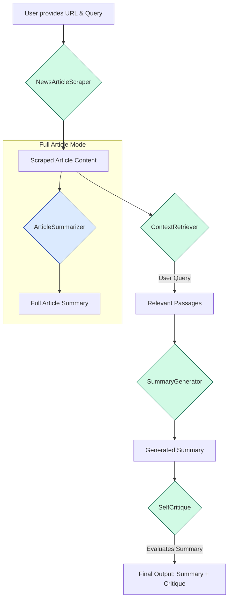

# 📰 News Article Summarizer & Query Engine

## 📖 Project Overview

This project is a sophisticated tool designed to scrape news articles from URL, generate comprehensive summaries, and answer specific user questions about the article's content in a concise manner. It leverages a pipeline of:

* Web scraping
* Context retrieval
* AI-powered summarization with self-critique

The application runs as an interactive **Streamlit** web app and supports both **Docker-based deployment**, **local setup**, and **CLI-based testing**.

---

## 🏗️ Architecture Diagram

The application follows a sequential data flow, where the output of one component becomes the input for the next.



---

## ⚙️ Setup Instructions

This guide walks you through running the app either using Docker, locally, or via CLI.

### 🚀 Quick Start

If you want the shortest path, use Docker Compose:

```bash
cp .env.example .env
docker compose up --build
```

Then open [http://localhost:8501](http://localhost:8501).

### 🔑 Step 1: Add Your API Keys

1. In the root of the project, create a file named `.env`
2. Add your API keys in the following format:

   ```env
   ANTHROPIC_API_KEY="your-anthropic-api-key"
   VOYAGE_API_KEY="your-voyage-api-key"
   ```

`ANTHROPIC_API_KEY` is required for article summaries and critique generation.
`VOYAGE_API_KEY` is required for the retrieval/chat flow because Anthropic does not currently provide its own embedding model.

---

### 🐳 Option 1: Run with Docker Compose (Recommended)

1. **Create your env file**

   ```bash
   cp .env.example .env
   ```

2. **Start the app**

   ```bash
   docker compose up --build
   ```

3. **Open the app**
   Go to [http://localhost:8501](http://localhost:8501) in your browser.

---

### 💻 Option 2: Run Locally Without Docker

1. **Clone the repository**
   First, clone the GitHub repo:

   ```bash
   git clone git@github.com:raadongithub/rag-news-summarizer.git
   cd rag-news-summarizer
   ```

2. **Install dependencies**
   Ensure you have Python installed. Then run:

   ```bash
   pip install uv
   uv pip install -r pyproject.toml
   ```

3. **Download NLTK data (one-time setup)**

   ```bash
   python -m nltk.downloader punkt
   ```

4. **Run the Streamlit app**

   ```bash
   streamlit run app.py
   ```

5. **Access the app**
   Your browser should open automatically. If not, go to the URL displayed in the terminal (typically [http://localhost:8501](http://localhost:8501)).

---

### 🖥️ Option 3: CLI-Based Testing

1. **Clone the repository**
   First, clone the GitHub repo:

   ```bash
   git clone git@github.com:raadongithub/rag-news-summarizer.git
   cd rag-news-summarizer
   ```

2. **Install dependencies**
   Ensure you have Python installed. Then run:

   ```bash
   pip install uv
   uv pip install -r pyproject.toml
   ```

3. **Download NLTK data (one-time setup)**

   ```bash
   python -m nltk.downloader punkt
   ```

4. **Run the CLI interface**

   ```bash
   python pipeline.py
   ```

5. **Using the CLI**
   - Enter a news article URL when prompted
   - Ask questions about the article content
   - Type `new` to switch to a different URL
   - Type `exit` to quit the program

   **Example CLI interaction:**
   ```
   Please enter the news article URL (or type 'exit' to quit): https://example.com/news-article
   URL set to: https://example.com/news-article

   Ask a question about the article (type 'new' for a new URL, 'exit' to quit): What is the main topic?
   [Pipeline executes and shows results]

   Ask a question about the article (type 'new' for a new URL, 'exit' to quit): new
   Overwriting URL...

   Please enter the news article URL (or type 'exit' to quit): exit
   Exiting the program. Goodbye!
   ```

---
