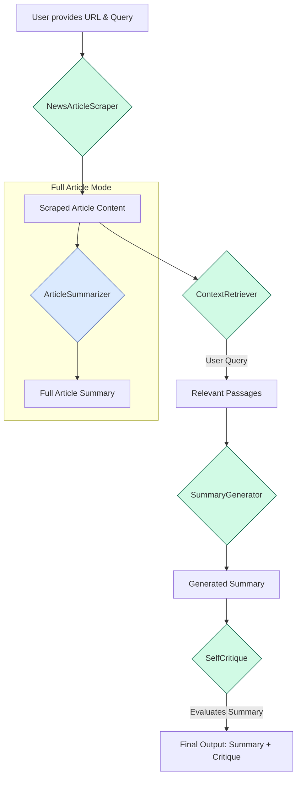

# 📰 News Article Summarizer & Query Engine

## 📖 Project Overview

This project is a sophisticated tool designed to scrape news articles from URL, generate comprehensive summaries, and answer specific user questions about the article's content in a concise manner. It leverages a pipeline of:

* Web scraping
* Context retrieval
* AI-powered summarization with self-critique

The application runs as an interactive **Streamlit** web app and supports **Docker-based deployment**, **local setup**, and **CLI-based testing**.

---

## 🏗️ Architecture Diagram

The application follows a sequential data flow, where the output of one component becomes the input for the next.



---

## ⚙️ Setup

### Step 1: Clone the Repository

```bash
git clone git@github.com:raadongithub/rag-news-summarizer.git
cd rag-news-summarizer
```

### Step 2: Add Your API Keys

Copy the example env file and fill in your keys:

```bash
cp .env.example .env
```

```env
ANTHROPIC_API_KEY="your-anthropic-api-key"
VOYAGE_API_KEY="your-voyage-api-key"
```

- `ANTHROPIC_API_KEY` — required for summarization and critique generation.
- `VOYAGE_API_KEY` — required for the retrieval/chat flow (Anthropic does not provide its own embedding model).

---

### 🐳 Option 1: Docker Compose (Recommended)

```bash
docker compose up --build
```

Open [http://localhost:8501](http://localhost:8501).

---

### 💻 Option 2: Streamlit App (Local)

Install dependencies and download NLTK data (one-time):

```bash
uv sync
uv run python -m nltk.downloader punkt
```

Run the app:

```bash
uv run streamlit run app.py
```

Open [http://localhost:8501](http://localhost:8501).

---

### 🖥️ Option 3: CLI

Install dependencies and download NLTK data (one-time):

```bash
uv sync
uv run python -m nltk.downloader punkt
```

Run the CLI:

```bash
uv run python pipeline.py
```

**Usage:**
- Enter a news article URL when prompted
- Ask questions about the article
- Type `new` to switch to a different URL
- Type `exit` to quit

**Example:**
```
Please enter the news article URL (or type 'exit' to quit): https://example.com/news-article
URL set to: https://example.com/news-article

Ask a question about the article (type 'new' for a new URL, 'exit' to quit): What is the main topic?
[Pipeline executes and shows results]

Ask a question about the article (type 'new' for a new URL, 'exit' to quit): new
Overwriting URL...

Please enter the news article URL (or type 'exit' to quit): exit
Exiting the program. Goodbye!
```